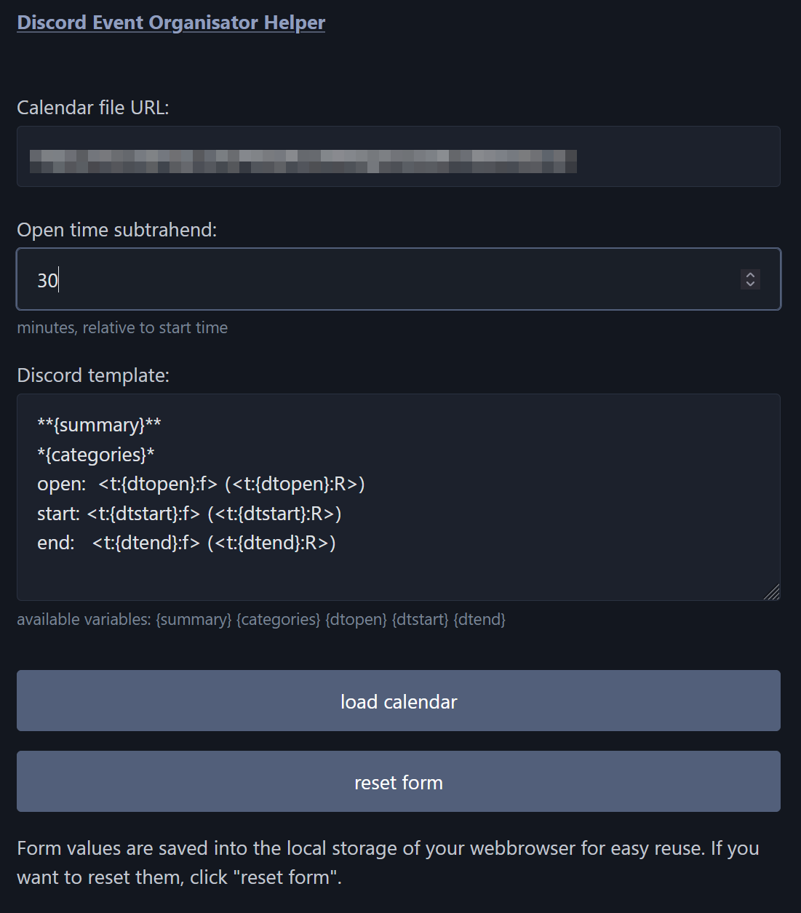

# deoh - Discord Event Organisator Helper

Helper tool - made for friends who organize parties - to load calendar information and display it in a copy & paste ready format for Discord (with those fancy timestamps 🙂).

## Usage

1. Enter the *Calendar file URL*.
2. Adjust the *Open time subtrahend*.
3. Click *load*.

Note1: Currently only *.ics calendar files from teamup.com are tested.
Note2: You can also access the data in the JSON format by querying **app/api.php**

If all goes well the events list will be displayed:

## Hosting

### Dependencies

- Webserver with PHP `>= 8.1.29`

### Installation

1. Upload the **app/** directory to your webserver.
2. Open **https://yourserver.org/app/** in a webbrowser.
